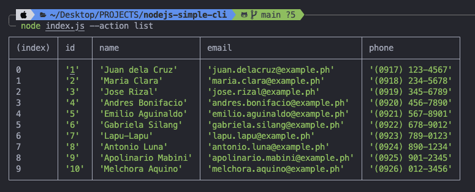
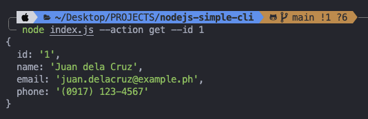
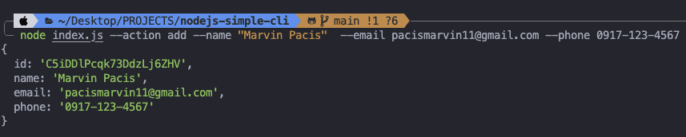
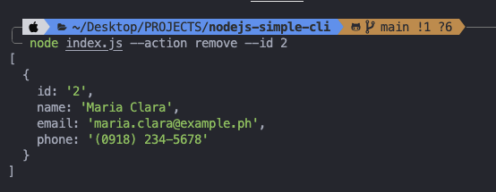

# Contact Management CLI

This project is a command-line interface (CLI) application for managing a list of contacts. Users can list all contacts, get a contact by ID, add a new contact, and remove a contact by ID.

## Table of Contents

- [Project Overview](#project-overview)
- [Usage](#usage)
  - [Prerequisites](#prerequisites)
  - [Installation](#installation)
  - [Commands](#commands)
- [Built With](#built-with)
- [Author](#author)

## Project Overview

This CLI application allows users to manage a list of contacts by performing CRUD (Create, Read, Update, Delete) operations. The contact data is stored in a JSON file.

## Usage

### Prerequisites

Ensure you have Node.js installed on your local machine.

### Installation

1. Clone the repository:

   ```bash
   git clone https://github.com/marventures/nodejs-simple-cli.git
   cd nodejs-simple-cli
   ```

2. Install dependencies:

   ```bash
   npm install
   ```

### Commands

1. `node index.js --action list`: List all contacts:



2. `node index.js --action get --id <contactId>`: Get a contact by ID



3. `node index.js --action add --name <name> --email <email> --phone <phone>`: Add a new contact:



4. `node index.js --action remove --id <contactId>`: Remove a contact by ID



## Built With

### Core

- [Node.js](https://nodejs.org/en): JavaScript runtime built on Chrome's V8 JavaScript engine.

### Utilities

- [Commander.js](https://www.npmjs.com/package/commander): A collection of common interactive command-line user interfaces.
- [nanoid](https://www.npmjs.com/package/nanoid): A simple QR Code generator.

## Author

- GitHub - [marventures](https://github.com/marventures)
- LinkedIn - [Marvin Morales Pacis](https://www.linkedin.com/in/marventures/)
